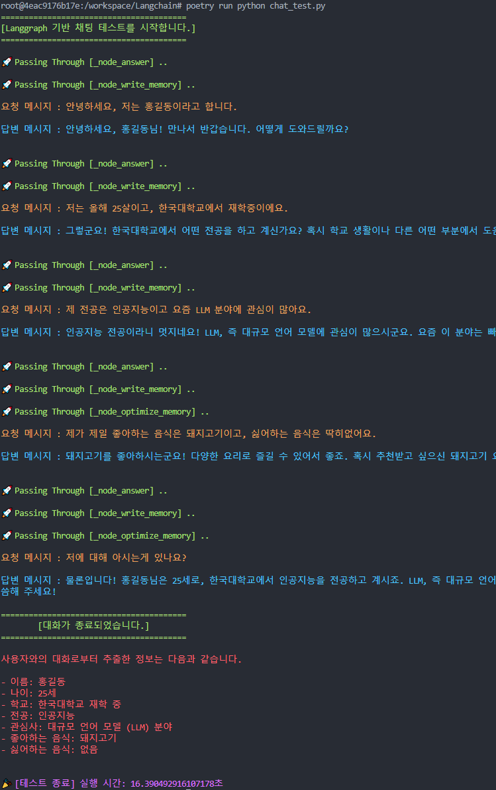
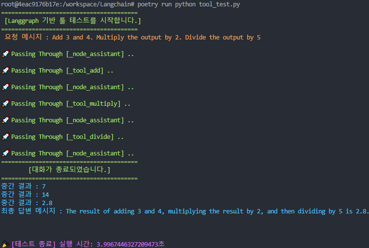

langchain-academy에서 제공하는 Langgraph 강의를 수강하면서 공부한 내용을 기록한 Repo 입니다.

자세한 강의 내용은 https://academy.langchain.com/collections 에서 확인 가능합니다. 


## 프로젝트 구조

저장소는 다음과 같이 구성되어 있습니다:

- `public/` : README나 기타 문서에서 사용되는 이미지들을 포함합니다.
- `modules/` : Langgraph 기능을 테스트하기 위한 다양한 라이브러리들을 포함합니다.
- `notebooks/` : 단계별 번호가 매겨진 Jupyter Notebook 파일들을 포함하여 테스트를 위한 파일들을 담고 있습니다.
- `utils/` : 환경 변수 설정과 그래프 실행 중 상태 확인을 위한 데코레이터들을 정의합니다.
- `chat_test.py` : Langgraph를 위한 간단한 채팅 테스트입니다.
- `tool_test.py` : Langgraph를 위한 간단한 도구 테스트입니다.

## 시작하기

### 설치
_Python 프로젝트 의존성 관리 및 패키지 배포를 위해 `poetry`를 사용합니다._

1. poetry 도구 다운로드
    ```bash
    curl -sSL https://install.python-poetry.org | python3.11 -
    ```

2. PATH 환경 변수에 poetry 추가

    ```bash
    export PATH="$HOME/.local/bin:$PATH"
    ```

3. poetry가 올바르게 설치되고 인식되는지 확인

    ```bash
    poetry --version
    ```

4. 각 프로젝트에 대한 가상 환경 구성

    ```bash
    poetry config virtualenvs.in-project true
    ```

5. 의존성 설치

    ```bash
    poetry install
    ```

## 빠른 시작

다음 명령어를 실행하여 간단히 Langgraph 테스트를 할 수 있습니다.

- 타입 1) 간단한 채팅 테스트 : 사용자 정보 수집

    ```bash
    poetry run python chat_test.py
    ```

    

- 타입 2) 도구 테스트 : 산술 연산 수행

    ```bash
    poetry run python tool_test.py
    ```

    
