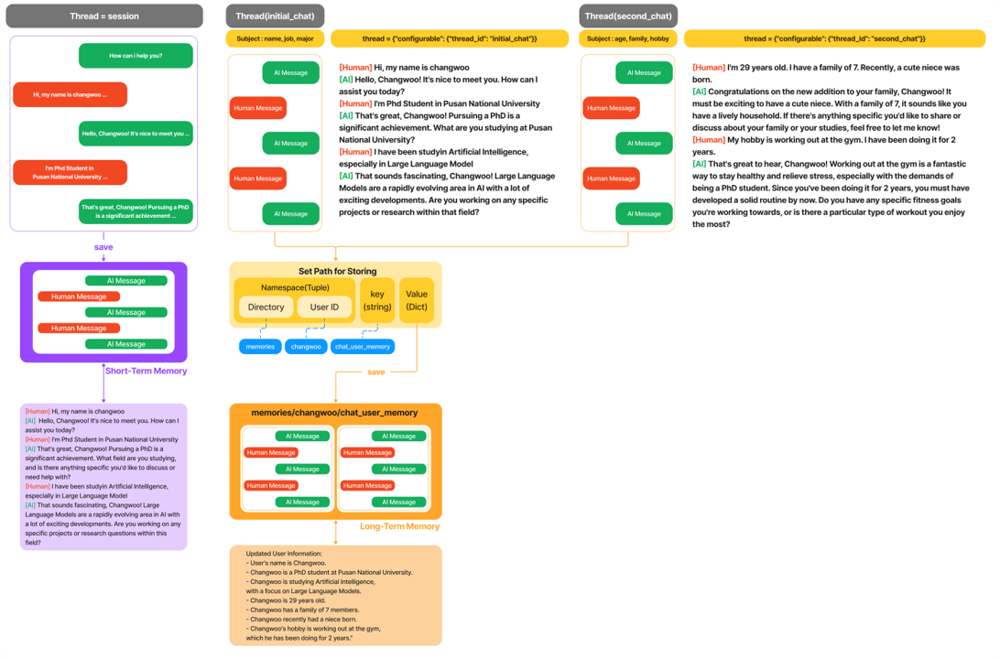

# Langchain Academy - Langgraph


### This is repo for Studying Langchain

You can install libraries with poetry

```bash
step 1. curl -sSL https://install.python-poetry.org | python3 -
step 2. export PATH="$HOME/.local/bin:$PATH"
step 3. poetry --version
```

if step 3 is done, you can just use this command

```bash
poetry install
```

### Repo Structure
- config : configuration for the project
- models : models for the project (in case using huggingface model not GPT)
- notebooks/LangGraph/Module_5_Long-Term_Memory : Studying LangGraph (Short-Term Memory, Long-Term Memory)

### notebooks/LangGraph/Module_5_Long-Term_Memory
- 02_memory_store.ipynb : Studying Memory Store

    
